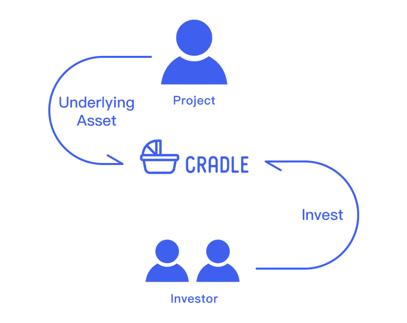

# Cradle

[Cradle](https://www.cradle.finance/) is a public chain-based transparent platform for project investment and fundraising. It consists of a series of smart contracts deployed on HECO.

Cradle is transparent for the codes of smart contracts are audited, verified, and open source; fundraisers and investors operate in a transparent manner; users are anonymous and censor-proof. Such features are intrinsic in blockchain, not distinctive in Cradle.
 
In Cradle, projects can quickly raise funds from users anywhere in the world for initiation and development of such projects with low cost. Investors can easily invest in DeFi projects and take part in projects to gain profits. Project institutions can display project information on Cradle, and raise funds for one or multiple phases. Investors can easily find excellent blockchain projects and invest in such projects based their analysis and judgment. After that investors will get the tokens of the project while project initiators can get the funding. In this platform, outstanding projects will attract investors, while poor-quality ones will be sifted out due to free market mechanism. As more and more projects and investors start cooperation on Cradle, the blockchain industry as a whole will get more diversified, healthy, and prosperous for long.

## Contact Us
Cradle Telegram: [https://t.me/CradleCommunity](https://t.me/CradleCommunity)
Cradle Twitter: [https://twitter.com/Cradle_fi](https://twitter.com/Cradle_fi)
